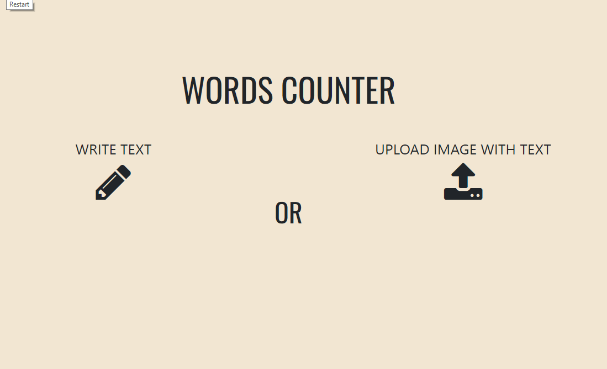
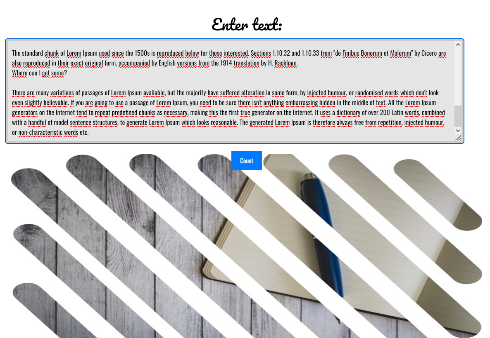

# Words counter

This project is a web application that counts words and characters in text.

## Features

The application counts words and characters:
- in text entered in a text field
- on a picture in.jpg format
- on the image sent from the camera (to do)

## Technologies Used

- Python
- Flask
- OpenCV
- HTML/CSS

## Installation

1. Clone the repository:

    ```bash
    git clone https://github.com/lilmarcin/words-counter.git

2. Navigate to the project directory:

    ```bash
    cd words-counter

3. Install the required dependencies:

    ```bash
    pip install -r requirements.txt

## Usage

1. Run the Flask application:

    ```bash
    python app.py

2. Open a web browser and go to http://localhost:5000.
3. On the home page, select the option you are interested in (write text or upload image with text).

3. In the `write text` option, type the text in the box and click`count`.


4. In the `upload image` option, type the image url and click `upload`.


## License
This project is licensed under the MIT License.